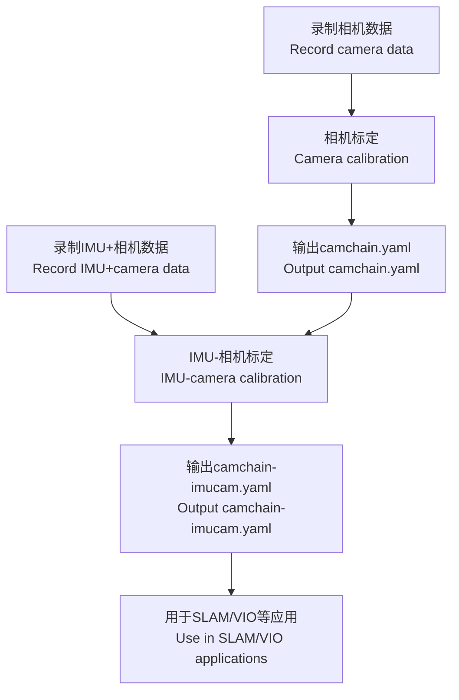

# Kalibr ROS2

**Kalibr标定工具箱的ROS2 Humble移植版本 - ✅ 迁移完成！**

**ROS2 Humble port of the Kalibr calibration toolbox - ✅ MIGRATION COMPLETE!**

---

## 📋 项目状态 | Project Status

**当前状态 | Current Status**: ✅ **所有34个软件包成功构建并安装！ | All 34 packages successfully built and installed!**

### ✅ 已完成功能 | Completed Features (100%)
- ✓ 所有34个C++包已迁移并编译 | All 34 C++ packages migrated and compiled
- ✓ 所有7个Python绑定包（Boost.Python）正常工作 | All 7 Python binding packages (Boost.Python) working
- ✓ ROS2 bag读取器适配（rosbag2_py）| ROS2 bag reader adaptation (rosbag2_py)
- ✓ 主应用程序（kalibr_imu_camera）就绪 | Main application (kalibr_imu_camera) ready
- ✓ Launch启动文件和配置示例 | Launch files and configuration examples
- ✓ 完整的10层依赖架构保留 | Complete 10-layer dependency architecture preserved
- ✓ 构建脚本和文档 | Build scripts and documentation
- ✓ **单相机和多相机标定** | **Single and multi-camera calibration**
- ✓ **单IMU和多IMU标定** | **Single and multi-IMU calibration**
- ✓ **时间同步标定** | **Temporal calibration**

### 📊 迁移统计 | Migration Statistics
- **软件包总数 | Total Packages**: 34
- **编译成功率 | Compilation Success**: 100%
- **构建时间 | Build Time**: ~10秒 | ~10 seconds
- **代码行数 | Lines of Code**: 100k+ C++/Python

---

## 🚀 快速开始 | Quick Start

### 1. 安装依赖 | Install Dependencies

#### 系统依赖 | System Dependencies
```bash
sudo apt install -y \
  libeigen3-dev \
  libboost-all-dev \
  libopencv-dev \
  libsuitesparse-dev \
  libtbb-dev \
  python3-numpy \
  python3-matplotlib \
  python3-scipy \
  python3-opencv
```

#### Python依赖 | Python Dependencies
```bash
pip install python-igraph
```

### 2. 构建工作空间 | Build Workspace

```bash
cd kalibr_ros2

# 按正确顺序构建所有包 | Build all packages in correct order
./build_workspace.sh

# 或构建特定层 | Or build specific layer only
./build_workspace.sh --layer 1

# 或从特定层构建到结束 | Or build from specific layer to end
./build_workspace.sh --from-layer 5

# 如果出现找不到某个包的情况，source后重新执行
# If a package is not found, source and re-execute
source install/setup.bash
./build_workspace.sh

# 激活工作空间 | Source the workspace
source install/setup.bash
```

### 3. 测试安装 | Test Installation
```bash
./test_installation.sh
```

---

## 🎯 功能特性 | Features

### 相机标定 | Camera Calibration
- ✅ 单相机内参标定 | Single camera intrinsic calibration
- ✅ 多相机系统内外参标定 | Multi-camera system intrinsic and extrinsic calibration
- ✅ 7种相机模型 | 7 camera models:
  - `pinhole-radtan` - 针孔+径向切向畸变 | Pinhole + radial-tangential distortion
  - `pinhole-equi` - 针孔+等距畸变（鱼眼）| Pinhole + equidistant (fisheye)
  - `pinhole-fov` - 针孔+FOV畸变 | Pinhole + FOV distortion
  - `omni-none` - 全向相机 | Omnidirectional camera
  - `omni-radtan` - 全向+径向切向畸变 | Omni + radial-tangential
  - `eucm-none` - 扩展统一相机模型 | Extended unified camera model
  - `ds-none` - 双球面模型 | Double sphere model

### IMU-相机标定 | IMU-Camera Calibration
- ✅ 单IMU-相机标定 | Single IMU-camera calibration
- ✅ **多IMU-相机标定** | **Multi-IMU camera calibration**
- ✅ 空间标定（外参）| Spatial calibration (extrinsics)
- ✅ 时间标定（时间偏移）| Temporal calibration (time offset)
- ✅ 多IMU间时间延迟估计 | Inter-IMU time delay estimation
- ✅ 3种IMU模型 | 3 IMU models:
  - `calibrated` - 使用厂商标定参数 | Use manufacturer calibrated parameters
  - `scale-misalignment` - 标定尺度和轴失准 | Calibrate scale and misalignment
  - `scale-misalignment-size-effect` - 额外标定尺寸效应 | Additionally calibrate size effect

### 标定板类型 | Calibration Target Types
- ✅ Aprilgrid（推荐）| Aprilgrid (recommended)
- ✅ 棋盘格 | Checkerboard
- ✅ 圆点阵列 | Circle grid

### 其他特性 | Other Features
- ✅ B样条连续时间轨迹表示 | B-spline based continuous-time trajectory
- ✅ 异常值过滤和鲁棒估计 | Outlier filtering and robust estimation
- ✅ 详细的PDF报告生成 | Detailed PDF report generation

---

## 📖 使用说明 | Usage Guide

### 相机标定 | Camera Calibration

#### 单相机标定 | Single Camera
```bash
# 录制数据 | Record data
ros2 bag record /cam0/image_raw -o camera_bag

# 运行标定 | Run calibration
ros2 run kalibr_imu_camera kalibr_calibrate_cameras \
  --bag camera_bag \
  --topics /cam0/image_raw \
  --models pinhole-radtan \
  --target aprilgrid.yaml \
  --show-extraction

# 或使用launch文件 | Or use launch file
ros2 launch kalibr_imu_camera calibrate_cameras.launch.py \
  bagfile:=camera_bag \
  topics:='/cam0/image_raw' \
  models:='pinhole-radtan' \
  target_yaml:=aprilgrid.yaml
```

#### 多相机标定 | Multi-Camera System
```bash
# 录制数据 | Record data
ros2 bag record /cam0/image_raw /cam1/image_raw -o camera_bag

# 运行标定 | Run calibration
ros2 run kalibr_imu_camera kalibr_calibrate_cameras \
  --bag camera_bag \
  --topics /cam0/image_raw /cam1/image_raw \
  --models pinhole-radtan pinhole-radtan \
  --target aprilgrid.yaml \
  --show-extraction
```

### IMU-相机标定 | IMU-Camera Calibration

#### 单IMU标定 | Single IMU
```bash
# 录制数据 | Record data
ros2 bag record /cam0/image_raw /imu0/data -o imu_camera_bag

# 运行标定 | Run calibration
ros2 run kalibr_imu_camera kalibr_calibrate_imu_camera \
  --bag imu_camera_bag \
  --cams camchain.yaml \
  --imu imu.yaml \
  --target aprilgrid.yaml \
  --show-extraction

# 或使用launch文件 | Or use launch file
ros2 launch kalibr_imu_camera calibrate_imu_camera.launch.py \
  bagfile:=imu_camera_bag \
  camchain:=camchain.yaml \
  imu:=imu.yaml \
  target_yaml:=aprilgrid.yaml
```

#### 多IMU标定 | Multi-IMU Calibration
```bash
# 录制数据 | Record data
ros2 bag record /cam0/image_raw /imu0/data /imu1/data -o multi_imu_bag

# 运行标定 | Run calibration
ros2 run kalibr_imu_camera kalibr_calibrate_imu_camera \
  --bag multi_imu_bag \
  --cams camchain.yaml \
  --imu imu0.yaml imu1.yaml \
  --imu-models calibrated calibrated \
  --imu-delay-by-correlation \
  --target aprilgrid.yaml \
  --show-extraction

# 或使用launch文件 | Or use launch file
ros2 launch kalibr_imu_camera calibrate_multi_imu.launch.py \
  bagfile:=multi_imu_bag \
  camchain:=camchain.yaml \
  imu0:=imu0.yaml \
  imu1:=imu1.yaml \
  target_yaml:=aprilgrid.yaml
```

---

## 📂 项目结构 | Package Structure

```
kalibr_ros2/
├── src/
│   ├── Layer 1: 基础工具 | Base utilities
│   │   ├── sm_common, sm_random, sm_logging
│   │   ├── python_module
│   │   ├── aslam_time
│   │   ├── numpy_eigen (numpy-Eigen转换 | numpy-Eigen conversion)
│   │   └── ethz_apriltag2 (AprilTag检测 | AprilTag detection)
│   ├── Layer 2-9: 核心库 | Core libraries
│   │   ├── sm_* (Schweizer-Messer工具集 | Schweizer-Messer utilities)
│   │   ├── aslam_* (ASLAM视觉和优化 | ASLAM vision and optimization)
│   │   ├── bsplines* (B样条库 | B-spline libraries)
│   │   └── incremental_calibration* (增量标定 | Incremental calibration)
│   └── Layer 10: 应用程序 | Application
│       └── kalibr_imu_camera (主标定包 | Main calibration package)
│           ├── scripts/ (可执行脚本 | Executable scripts)
│           │   ├── kalibr_calibrate_cameras (多相机标定 | Multi-camera)
│           │   └── test_multi_imu.sh (测试脚本 | Test script)
│           ├── launch/ (启动文件 | Launch files)
│           │   ├── calibrate_cameras.launch.py
│           │   ├── calibrate_imu_camera.launch.py
│           │   └── calibrate_multi_imu.launch.py
│           ├── config/ (配置示例 | Configuration examples)
│           │   ├── imu0_example.yaml, imu1_example.yaml
│           │   ├── example_cameras.yaml
│           │   └── target_april_example.yaml
│           └── python/ (Python库 | Python libraries)
│               ├── kalibr_camera_calibration/
│               ├── kalibr_imu_camera_calibration/
│               └── kalibr_common/
├── build_workspace.sh (依赖顺序构建脚本 | Dependency-ordered build)
├── build_order.txt (完整依赖层次 | Complete dependency hierarchy)
└── test_installation.sh (安装测试 | Installation test)
```

---

## 📝 配置文件示例 | Configuration Examples

### Aprilgrid标定板 | Aprilgrid Target
```yaml
target_type: 'aprilgrid'
tagCols: 6      # 列数 | Number of columns
tagRows: 6      # 行数 | Number of rows
tagSize: 0.088  # 标签大小[米] | Tag size [m]
tagSpacing: 0.3 # 标签间距（占tagSize的百分比）| Tag spacing (fraction of tagSize)
```

### 棋盘格标定板 | Checkerboard Target
```yaml
target_type: 'checkerboard'
targetCols: 8   # 内部角点列数 | Number of internal corner columns
targetRows: 6   # 内部角点行数 | Number of internal corner rows
rowSpacingMeters: 0.025  # 行间距[米] | Row spacing [m]
colSpacingMeters: 0.025  # 列间距[米] | Column spacing [m]
```

### IMU配置 | IMU Configuration
```yaml
#Accelerometer | 加速度计
accelerometer_noise_density: 0.006   # [m/s^2/sqrt(Hz)]
accelerometer_random_walk: 0.0002    # [m/s^3/sqrt(Hz)]

#Gyroscope | 陀螺仪
gyroscope_noise_density: 0.0004      # [rad/s/sqrt(Hz)]
gyroscope_random_walk: 4.0e-06       # [rad/s^2/sqrt(Hz)]

#IMU update rate | 更新频率
update_rate: 200.0                   # [Hz]

#IMU ROS topic | ROS话题
rostopic: /imu0/data
```

配置文件示例见 `src/kalibr_imu_camera/config/` 目录。

See example configuration files in `src/kalibr_imu_camera/config/`.

---

## 📚 详细文档 | Detailed Documentation

- [README.md](src/kalibr_imu_camera/README.md) - 工具包总览 | Package overview
- [CAMERA_CALIBRATION.md](src/kalibr_imu_camera/CAMERA_CALIBRATION.md) - 相机标定详细说明 | Camera calibration guide
- [MULTI_IMU_CALIBRATION.md](src/kalibr_imu_camera/MULTI_IMU_CALIBRATION.md) - 多IMU标定详细说明 | Multi-IMU calibration guide

---

## 🔄 完整标定流程 | Complete Calibration Workflow

### 方法1：分步标定 | Method 1: Step-by-step



**步骤 | Steps:**

1. **相机标定 | Camera Calibration**
   ```bash
   # 录制 | Record
   ros2 bag record /cam0/image_raw /cam1/image_raw -o camera_bag
   
   # 标定 | Calibrate
   ros2 run kalibr_imu_camera kalibr_calibrate_cameras \
     --bag camera_bag \
     --topics /cam0/image_raw /cam1/image_raw \
     --models pinhole-radtan pinhole-radtan \
     --target aprilgrid.yaml \
     --show-extraction
   
   # 获得 | Obtain: camchain-TIMESTAMP.yaml
   ```

2. **IMU-相机标定 | IMU-Camera Calibration**
   ```bash
   # 录制 | Record
   ros2 bag record /cam0/image_raw /imu0/data -o imu_camera_bag
   
   # 标定 | Calibrate
   ros2 run kalibr_imu_camera kalibr_calibrate_imu_camera \
     --bag imu_camera_bag \
     --cams camchain-TIMESTAMP.yaml \
     --imu imu.yaml \
     --target aprilgrid.yaml \
     --show-extraction
   
   # 获得 | Obtain: camchain-imucam.yaml, imu.yaml
   ```

3. **多IMU标定（可选）| Multi-IMU Calibration (Optional)**
   ```bash
   # 录制 | Record
   ros2 bag record /cam0/image_raw /imu0/data /imu1/data -o multi_imu_bag
   
   # 标定 | Calibrate
   ros2 run kalibr_imu_camera kalibr_calibrate_imu_camera \
     --bag multi_imu_bag \
     --cams camchain-TIMESTAMP.yaml \
     --imu imu0.yaml imu1.yaml \
     --imu-models calibrated calibrated \
     --imu-delay-by-correlation \
     --target aprilgrid.yaml \
     --show-extraction
   ```

---

## 📦 测试数据 | Test Dataset

### 下载测试数据 | Download Test Data
测试数据可以在[Kalibr官方Wiki](https://github.com/ethz-asl/kalibr/wiki/downloads)中下载。

Test datasets can be downloaded from the [official Kalibr Wiki](https://github.com/ethz-asl/kalibr/wiki/downloads).

### 转换ROS1 bag到ROS2 | Convert ROS1 bag to ROS2
```bash
# 安装转换工具 | Install conversion tool
pip install rosbags

# 转换 | Convert
rosbags-convert --src xxx.bag --dst dst_path
```

---

## 🔧 从ROS1 Kalibr的主要变更 | Key Changes from ROS1 Kalibr

### ROS2适配 | ROS2 Adaptations
1. **Bag格式 | Bag Format**: 从`rosbag` (ROS1)迁移到`rosbag2_py` (ROS2 SQLite3格式)
   - Migrated from `rosbag` (ROS1) to `rosbag2_py` (ROS2 SQLite3 format)

2. **消息API | Message API**: 时间戳访问从`secs/nsecs`更新为`sec/nanosec`
   - Updated timestamp access from `secs/nsecs` to `sec/nanosec`

3. **消息类型 | Message Types**: 适配ROS2消息类型系统（使用`rosidl_runtime_py`）
   - Adapted to ROS2 message type system using `rosidl_runtime_py`

4. **构建系统 | Build System**: 从catkin转换为ament_cmake/ament_cmake_python
   - Converted from catkin to ament_cmake/ament_cmake_python

5. **Python**: 仅支持Python 3（移除Python 2兼容性）
   - Python 3 only (removed Python 2 compatibility)

6. **numpy_eigen模块 | numpy_eigen Module**: 修复了模块导出和安装路径
   - Fixed module export and installation path

### 移除的依赖 | Removed Dependencies
- 不再支持ROS1 rosbag | No ROS1 rosbag support
- 移除了`mv_cameras/ImageSnappyMsg`支持（ROS2中不常用）
  - Removed `mv_cameras/ImageSnappyMsg` support (uncommon in ROS2)

---

## ⚠️ 已知问题和解决方案 | Known Issues and Solutions

### 1. 多线程问题 | Multithreading Issue
**问题 | Issue**: numpy_eigen模块在多线程环境下可能出现问题

**Problem**: numpy_eigen module may have issues in multithreaded environment

**解决方案 | Solution**: 使用`--show-extraction`参数禁用多线程

**Solution**: Use `--show-extraction` flag to disable multithreading

### 2. 编译依赖问题 | Build Dependency Issue
**问题 | Issue**: 由于包之间依赖关系复杂，首次编译可能找不到某些包

**Problem**: Due to complex inter-package dependencies, first build may fail to find some packages

**解决方案 | Solution**: 
```bash
source install/setup.bash
./build_workspace.sh
# 重复执行直到所有包编译成功 | Repeat until all packages build successfully
```

### 3. 标定板检测失败 | Calibration Target Detection Failure
**问题 | Issue**: 找不到标定板

**Problem**: Cannot detect calibration target

**解决方案 | Solution**:
- 确保光照条件良好 | Ensure good lighting conditions
- 检查标定板配置文件是否正确 | Check target configuration file
- 使用`--show-extraction`查看检测过程 | Use `--show-extraction` to view detection process
- 减慢运动速度避免模糊 | Slow down motion to avoid blur

---

## 🤝 贡献 | Contributing

欢迎贡献！请提交Issue或Pull Request。

Contributions are welcome! Please submit Issues or Pull Requests.

---

## 📄 许可证 | License

BSD许可证 - 详见各个包的LICENSE文件。

BSD License - See individual package LICENSE files.

---

## 👥 作者 | Authors

### 原始Kalibr作者 | Original Kalibr Authors:
- Paul Furgale
- Hannes Sommer
- Jérôme Maye
- Jörn Rehder
- Thomas Schneider
- Luc Oth

### ROS2移植 | ROS2 Port:
- 2026年1月 | January 2026

---

## 📖 参考文献 | References

关于标定方法的技术细节，请参阅：

For technical details about the calibration approach, see:

1. J. Rehder et al. (2016). "Extending kalibr: Calibrating the extrinsics of multiple IMUs"
2. P. Furgale et al. (2013). "Unified Temporal and Spatial Calibration for Multi-Sensor Systems"
3. P. Furgale et al. (2012). "Continuous-Time Batch Estimation Using Temporal Basis Functions"

---

## 🔗 相关链接 | Related Links

- [原始Kalibr项目 | Original Kalibr Project](https://github.com/ethz-asl/kalibr)
- [Kalibr Wiki](https://github.com/ethz-asl/kalibr/wiki)
- [相机模型详解 | Camera Models](https://github.com/ethz-asl/kalibr/wiki/supported-models)
- [标定板制作 | Calibration Targets](https://github.com/ethz-asl/kalibr/wiki/calibration-targets)
- [测试数据下载 | Test Data Downloads](https://github.com/ethz-asl/kalibr/wiki/downloads)
