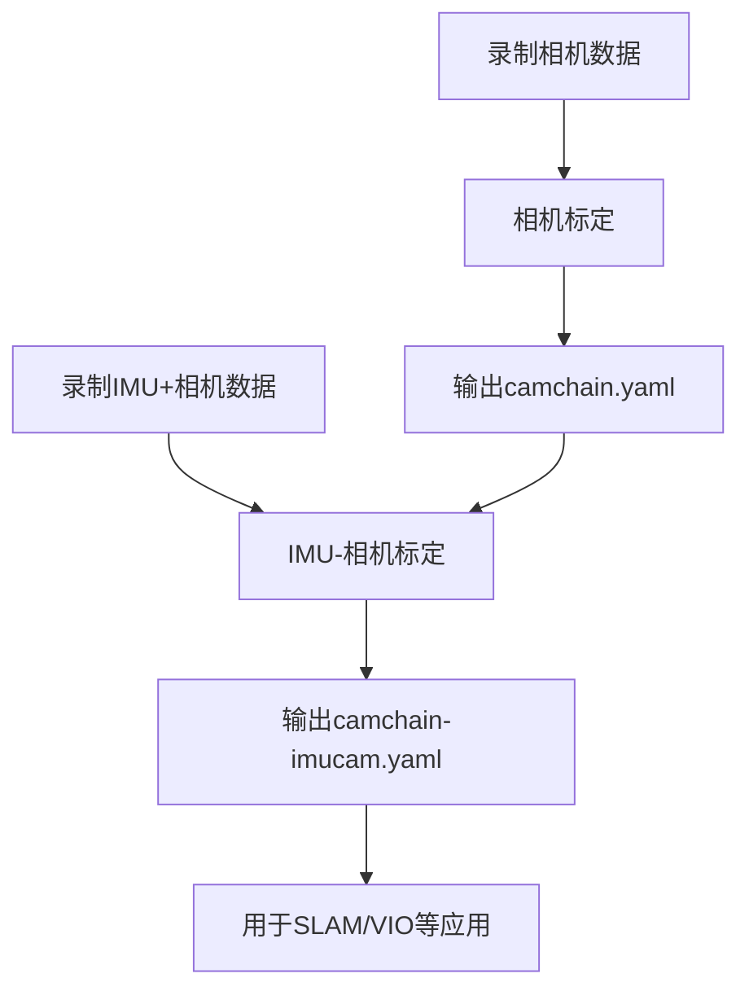

# Kalibr ROS2 - 相机与IMU标定工具包

## 概述

Kalibr ROS2 是Kalibr标定工具包的ROS2移植版本，用于标定相机和IMU传感器系统。本工具包支持：

- ✅ 单相机和多相机内参标定
- ✅ 相机链外参标定（多相机间的相对位姿）
- ✅ 单IMU-相机标定
- ✅ **多IMU-相机标定**（同时标定多个IMU）
- ✅ 时间同步标定
- ✅ 多种相机模型（针孔、鱼眼、全向等）
- ✅ 多种IMU模型（已标定、尺度-失准等）

## 功能特性

### 相机标定
- 支持7种相机模型：
  - pinhole-radtan (针孔+径向切向畸变)
  - pinhole-equi (针孔+等距畸变，鱼眼)
  - pinhole-fov (针孔+FOV畸变)
  - omni-none (全向相机)
  - omni-radtan (全向+径向切向畸变)
  - eucm-none (扩展统一相机模型)
  - ds-none (双球面模型)
- 单相机内参标定
- 多相机系统内外参标定
- 异常值过滤和鲁棒估计

### IMU-相机标定
- 单IMU或多IMU系统标定
- 空间标定（IMU与相机的相对位姿）
- 时间标定（IMU与相机的时间偏移）
- 多IMU间时间延迟估计
- 支持三种IMU模型：
  - calibrated: 使用厂商标定参数
  - scale-misalignment: 标定尺度和轴失准
  - scale-misalignment-size-effect: 额外标定尺寸效应

### 标定板类型
- Aprilgrid (推荐)
- 棋盘格 (Checkerboard)
- 圆点阵列 (Circle grid)

## 安装依赖

### Python依赖
```bash
pip install python-igraph
```

### ROS2依赖
所有C++依赖已包含在工具包中，无需额外安装。

## 快速开始

### 1. 相机标定

#### 单相机标定
```bash
ros2 run kalibr_imu_camera kalibr_calibrate_cameras \
  --bag camera_bag \
  --topics /cam0/image_raw \
  --models pinhole-radtan \
  --target aprilgrid.yaml \
  --show-extraction
```

#### 双相机系统标定
```bash
ros2 run kalibr_imu_camera kalibr_calibrate_cameras \
  --bag camera_bag \
  --topics /cam0/image_raw /cam1/image_raw \
  --models pinhole-radtan pinhole-radtan \
  --target aprilgrid.yaml \
  --show-extraction
```

使用launch文件：
```bash
ros2 launch kalibr_imu_camera calibrate_cameras.launch.py \
  bagfile:=camera_bag \
  topics:='/cam0/image_raw /cam1/image_raw' \
  models:='pinhole-radtan pinhole-radtan' \
  target_yaml:=aprilgrid.yaml
```

### 2. 单IMU-相机标定

```bash
ros2 run kalibr_imu_camera kalibr_calibrate_imu_camera \
  --bag imu_camera_bag \
  --cams camchain.yaml \
  --imu imu.yaml \
  --target aprilgrid.yaml \
  --show-extraction
```

使用launch文件：
```bash
ros2 launch kalibr_imu_camera calibrate_imu_camera.launch.py \
  bagfile:=imu_camera_bag \
  camchain:=camchain.yaml \
  imu:=imu.yaml \
  target_yaml:=aprilgrid.yaml
```

### 3. 多IMU-相机标定

```bash
ros2 run kalibr_imu_camera kalibr_calibrate_imu_camera \
  --bag multi_imu_bag \
  --cams camchain.yaml \
  --imu imu0.yaml imu1.yaml \
  --imu-models calibrated calibrated \
  --imu-delay-by-correlation \
  --target aprilgrid.yaml \
  --show-extraction
```

使用launch文件：
```bash
ros2 launch kalibr_imu_camera calibrate_multi_imu.launch.py \
  bagfile:=multi_imu_bag \
  camchain:=camchain.yaml \
  imu0:=imu0.yaml \
  imu1:=imu1.yaml \
  target_yaml:=aprilgrid.yaml
```

## 详细文档

- [相机标定详细说明](CAMERA_CALIBRATION.md)
- [多IMU标定详细说明](MULTI_IMU_CALIBRATION.md)

## 配置文件示例

### Aprilgrid标定板配置
```yaml
target_type: 'aprilgrid'
tagCols: 6      # 列数
tagRows: 6      # 行数
tagSize: 0.088  # 标签大小 [米]
tagSpacing: 0.3 # 标签间距（占tagSize的百分比）
```

### IMU配置
```yaml
#Accelerometer
accelerometer_noise_density: 0.006   # [m/s^2/sqrt(Hz)]
accelerometer_random_walk: 0.0002    # [m/s^3/sqrt(Hz)]

#Gyroscope  
gyroscope_noise_density: 0.0004      # [rad/s/sqrt(Hz)]
gyroscope_random_walk: 4.0e-06       # [rad/s^2/sqrt(Hz)]

#IMU update rate
update_rate: 200.0                   # [Hz]

#IMU ROS topic
rostopic: /imu0/data
```

更多配置示例见 `config/` 目录。

## 工具链使用流程

### 完整标定流程



### 步骤详解

1. **相机标定**
   - 录制bag：`ros2 bag record /cam0/image_raw /cam1/image_raw -o camera_bag`
   - 运行标定：`ros2 run kalibr_imu_camera kalibr_calibrate_cameras ...`
   - 获得：`camchain-TIMESTAMP.yaml`

2. **IMU-相机标定**
   - 录制bag：`ros2 bag record /cam0/image_raw /imu0/data -o imu_camera_bag`
   - 运行标定：`ros2 run kalibr_imu_camera kalibr_calibrate_imu_camera ...`
   - 获得：`camchain-imucam.yaml`, `imu.yaml`

3. **多IMU-相机标定**
   - 录制bag：`ros2 bag record /cam0/image_raw /imu0/data /imu1/data -o multi_imu_bag`
   - 运行标定：`ros2 run kalibr_imu_camera kalibr_calibrate_imu_camera --imu imu0.yaml imu1.yaml ...`
   - 获得：`camchain-imucam.yaml`, `imu.yaml` (包含所有IMU)

## 输出文件说明

### 相机标定输出
- `camchain-TIMESTAMP.yaml`: 相机内参和外参
- `report-cam-TIMESTAMP.pdf`: 标定报告
- `results-cam-TIMESTAMP.txt`: 详细结果

### IMU-相机标定输出
- `camchain-imucam.yaml`: 相机链+IMU标定结果
- `imu.yaml`: IMU独立配置
- `report-imucam.pdf`: 标定报告
- `results-imucam.txt`: 详细结果
- `poses-imucam-imu0.csv`: 优化后的位姿（可选）

## 多IMU标定特性

### 支持功能
- ✅ 同时标定多个IMU
- ✅ 自动选择第一个IMU为参考IMU
- ✅ 估计IMU间的相对位姿
- ✅ 估计IMU间的时间延迟（通过相关性）
- ✅ 支持不同的IMU模型组合
- ✅ 自动查找IMU间的方向先验

### 使用场景
- 冗余IMU系统（提高可靠性）
- 分布式IMU阵列（大型平台）
- 异构IMU融合（不同精度的IMU）
- IMU对比验证

### 关键参数
- `--imu imu0.yaml imu1.yaml imu2.yaml`: 指定多个IMU配置
- `--imu-models calibrated calibrated scale-misalignment`: 每个IMU的模型类型
- `--imu-delay-by-correlation`: 估计IMU间时间延迟（推荐）

详见 [多IMU标定详细说明](MULTI_IMU_CALIBRATION.md)

## 常见问题

### Q: 标定失败，找不到标定板
**A**: 
- 确保光照良好
- 检查标定板配置正确
- 使用`--show-extraction`查看检测过程
- 减慢运动速度

### Q: 重投影误差太大
**A**:
- 重新采集数据，确保覆盖整个图像区域
- 检查标定板物理尺寸准确
- 增加`--mi-tol`只使用高质量图像
- 启用`--use-blakezisserman`

### Q: 多IMU标定结果不理想
**A**:
- 确保数据采集包含充分的6自由度运动
- 检查IMU noise参数是否合理
- 启用`--imu-delay-by-correlation`
- 检查IMU的物理安装是否牢固

### Q: 程序运行很慢
**A**:
- 使用`--show-extraction`禁用多线程
- 减少图像频率：`--bag-freq 4`
- 增大`--mi-tol`减少使用的图像数量

## 已知问题

1. **多线程问题**: numpy_eigen模块在多线程环境下可能有问题，建议使用`--show-extraction`禁用多线程
2. **时间戳格式**: 确保ROS2 bag的时间戳格式正确

## 测试

### 编译
```bash
cd kalibr_ros2
colcon build --packages-select kalibr_imu_camera --symlink-install
source install/setup.bash
```

### 运行测试
```bash
# 测试相机标定帮助
ros2 run kalibr_imu_camera kalibr_calibrate_cameras --help

# 测试IMU-相机标定帮助
ros2 run kalibr_imu_camera kalibr_calibrate_imu_camera --help
```

## 参考链接

- [原始Kalibr项目](https://github.com/ethz-asl/kalibr)
- [Kalibr Wiki](https://github.com/ethz-asl/kalibr/wiki)
- [相机模型详解](https://github.com/ethz-asl/kalibr/wiki/supported-models)
- [标定板制作](https://github.com/ethz-asl/kalibr/wiki/calibration-targets)

## 许可证

本项目基于原始Kalibr项目，遵循相同的许可证。

## 贡献者

- 原始Kalibr: ETH ASL
- ROS2移植: [您的信息]

## 更新日志

### v1.0.0 (2026-01-05)
- ✅ 完成ROS2基础移植
- ✅ 修复numpy_eigen模块导出问题
- ✅ 添加多相机标定功能
- ✅ 完善多IMU标定文档
- ✅ 添加launch文件和配置示例
